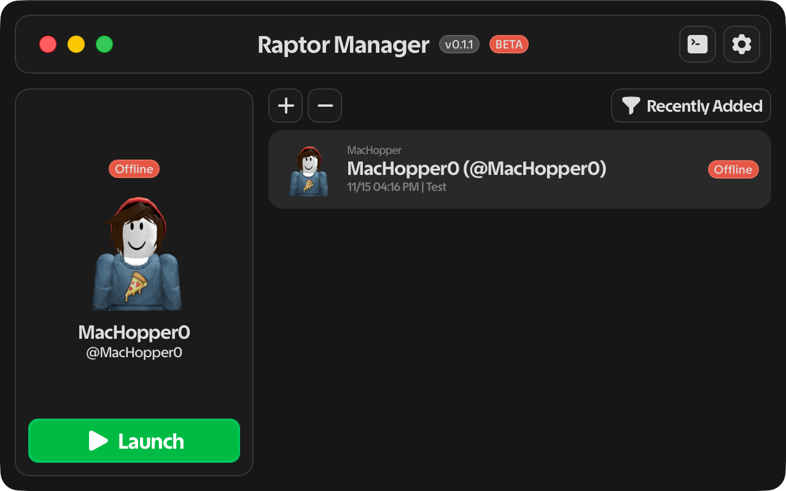

> [!CAUTION]
> Using [Roblox](https://www.roblox.com) executors may result in your account being banned. Use at your own risk. The developers are not responsible for any consequences.

    

# Raptor Manager

### A powerful macOS account manager for Roblox clients

    

## 🎯 About

**Raptor Manager** is a native macOS application built with Tauri that supports multiple roblox executors and vanilla roblox, it revolutionizes how you manage multiple Roblox accounts. Provides a secure, automatic cookie handling via macOS Keychain, and a built-in Lua/Luau decompiler.

## 📄 License
This project is licensed under the **MIT License** - see the [LICENSE](LICENSE) file for details.
